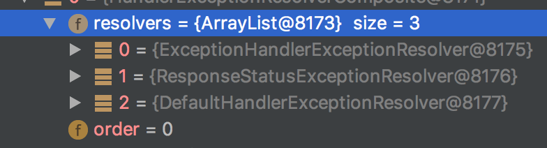

#说明

#简介
全局统一处理异常的三种方式


## 方式一 实现org.springframework.web.servlet.HandlerExceptionResolver接口的resolveException方法   

此方法如果返回null表示不对异常处理，由下一个异常解析器处理。如果返回一个视图实例，说明对此异常进入解析并处理。

如下解析类只会对BindException进行解析处理
```java
@Component
public class MyExceptionHandlerResolver implements HandlerExceptionResolver, Ordered {
    @Override
    public ModelAndView resolveException(HttpServletRequest request, HttpServletResponse response, Object handler, Exception ex) {
        if (ex instanceof BindException) {
            ModelAndView modelAndView = new ModelAndView(new MappingJackson2JsonView());
            modelAndView.addObject("status", "false");
            modelAndView.addObject("release", ex.getMessage());

            return modelAndView;
        }

        return null;
    }

    @Override
    public int getOrder() {
        return Ordered.HIGHEST_PRECEDENCE;
    }
}
```


## 问题一
我实现HandlerExceptionResolve接口，想拦截BindException但是怎样配制都拦截不到。

原因在于，SpringMvc默认有多个异常解析器，DefaultHandlerExceptionResolver就是其中一个，而且它处理了BindException; 同是，更为重要的是，它的顺序在自定义异常解析器之前，而org.springframework.web.servlet.DispatcherServlet.processHandlerException中是按照这些解析器的顺序来处理异常的，一旦前面的解析器处理产生结果，后面的将不再执行。

```java
ModelAndView exMv = null;
for (HandlerExceptionResolver handlerExceptionResolver : this.handlerExceptionResolvers) {
    exMv = handlerExceptionResolver.resolveException(request, response, handler, ex);
    if (exMv != null) {
        break;
    }
}
```

解决方法：把自定义异常处理器的顺序提前
实现org.springframework.core.Ordered接口的getOrder()方法
```java
public class MyExceptionHandlerResolver2 implements HandlerExceptionResolver, Ordered {

    @Override
    public int getOrder() {
        return Ordered.HIGHEST_PRECEDENCE;
    }
}
```

使用org.springframework.core.annotation.Order注解
```java
@Order(value = Ordered.HIGHEST_PRECEDENCE)
@Component
public class MyExceptionHandlerResolver2 implements HandlerExceptionResolver {
    
}
```

## 方式二：使用@ExceptionHandler注解

如下所示，exceptionHandler方法会处理ExceptionController2下注有@RequestMapping方法抛出的BindException异常
```java
@Controller
@RequestMapping("/exception2")
public class ExceptionController2 {

    @ExceptionHandler
    @ResponseBody
    public String exceptionHandler(BindException ex) {
        return "捕猎了BindException";
    }


    @RequestMapping("/bind")
    @ResponseBody
    public String sayHello01() throws BindException {
        throw new BindException(new Object(), "obj");
    }
}
```


### 方式三：使用@ControllerAdvise
如下所示，exceptionHandler会处理ExceptionController所在包下所有控制器注有@RequestMapping方法抛出的Exception异常
```java
@ControllerAdvice(basePackageClasses = ExceptionController.class)
public class MyControllerAdvice {

    @ExceptionHandler
    @ResponseBody
    public String exceptionHandler(Exception ex) {
        return "MyControllerAdvice handler";
    }
}
```

## 总结
这三种异常处理混合使用的时候，一定要注意顺序。     

DispathcerServlet默认注册了HandlerExceptionResolverComposite其Order为0
其下有ExceptionHandlerExceptionResolver 也就是处理@ExceptionHandler的解析器，排在第一位。

DefaultHandlerExceptionResolver解析器 其处理一些Spring定义的异常，详情如下
[22.11.3 Handling Standard Spring MVC Exceptions](https://docs.spring.io/spring/docs/4.3.18.RELEASE/spring-framework-reference/htmlsingle/#mvc-ann-rest-spring-mvc-exceptions)