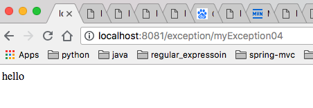
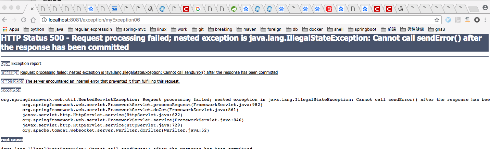

# 说明

## 简介
此示例说明了@ResponseStatus的三种用法  


## @ResponseStatus的三种用法  
* 可以用于异常类
* 可以用于标记有@Controller的类
* 可以用于标记有@Controller类下的@RequestMapping方法


##用于异常类

```java
@ResponseStatus(value = HttpStatus.INTERNAL_SERVER_ERROR, reason = "服务器内部错误")
public class MyException extends Exception{
   
}

```

```java
@RequestMapping("/exception")
@Controller
public class ExceptionController {

    @RequestMapping("/myException")
    @ResponseBody
    public String myException() throws MyException {
        throw new MyException();
    }
}
```
此时访问页面的会返回如下：


##用于标记有@Controller的类
```java
@RequestMapping("/exception2")
@Controller
@ResponseStatus(value = HttpStatus.FORBIDDEN, reason = "forbidden")
public class ExceptionController2 {

    @ResponseBody
    @RequestMapping("/my01")
    public String my01() {
        return "my01";
    }

    @ResponseBody
    @RequestMapping("/my02")
    public String my02() {
        return "my02";
    }
}

```
此时访问相应的链接会返回如下错误页面：      


## 用于标记有@Controller类下的@RequestMapping方法

```java
@RequestMapping("/exception")
@Controller
public class ExceptionController {


    @RequestMapping("/myException02")
    @ResponseBody
    @ResponseStatus(value = HttpStatus.BAD_GATEWAY, reason = "bad gateway")
    public String myException02() {
        return "myException02";
    }
}
```
此时访问相应的链接会返回如下错误页面：       


## 注意事项
1.标记有@ReponseStatus注解的方法不能抛出异常，否则此注解会失效。

如
```java
@RequestMapping("/exception")
@Controller
public class ExceptionController {


    @RequestMapping("/myException03")
    @ResponseBody
    @ResponseStatus(value = HttpStatus.BAD_GATEWAY, reason = "bad gateway")
    public String myException03() throws Exception {
        throw new Exception("myException03");
    }
}
```
此时访问相就的链接，不会返回期待的错误页面而是       


2.标记有@ReponseStatus注解的方法返回的是ResponseEntity或重定向"redirect:/path"，此注解会失效。  
如
```java
@RequestMapping("/exception")
@Controller
public class ExceptionController {

    @RequestMapping("/myException04")
    @ResponseStatus(value = HttpStatus.BAD_GATEWAY, reason = "bad gateway")
    public ResponseEntity<String> myException04(){
        ResponseEntity<String> entity = new ResponseEntity<>("hello", HttpStatus.BAD_GATEWAY);
        return entity;
    }

    @RequestMapping("/myException05")
    @ResponseStatus(value = HttpStatus.BAD_GATEWAY, reason = "bad gateway")
    public String myException05() {
        return "redirect:/exception/myException";
    }
}
```
访问/exception/myException04返回的是如下页面， @ResponseStatus注解失效了。  



3.标记有@ReponseStatus注解的异常，将来会用到HttpServletReponse.sendError，如果你在代码中也用到了HttpServletReponse.sendError
将会抛出IllegalStateException。

如
```java
@RequestMapping("/exception")
@Controller
public class ExceptionController {
    @ResponseStatus(value = HttpStatus.BAD_GATEWAY, reason = "bad gateway")
    @RequestMapping("/myException06")
    public void myException06(HttpServletResponse response) throws IOException {
        response.sendError(500, "error 500");
    }
}
```
访问此链接将会抛出    
